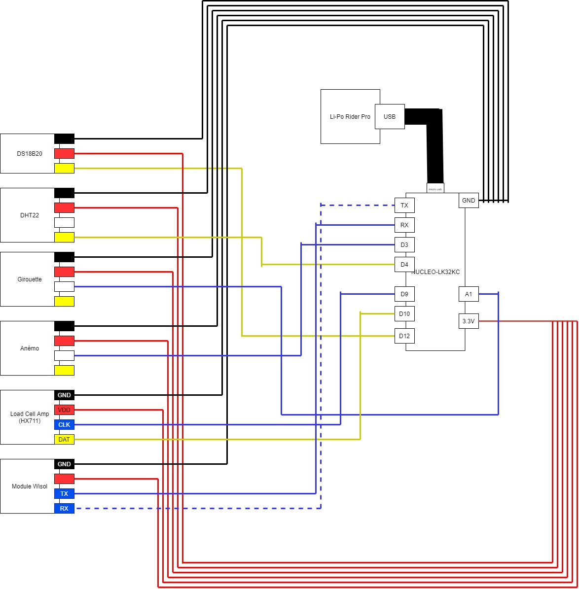
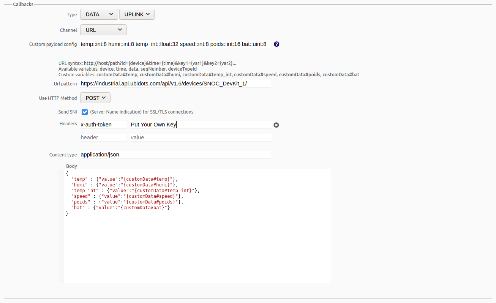

# Projet Open Ruche 2020-2021

Ce projet avait pour but de concevoir une ruche connectée afin de vérifier la production de miel des abeilles ainsi que leur bonne santé. Il a été conduit de     
septembre 2020 jusque janvier 2021 par quatre élèves de Polytech Sorbonne EISE4 : Clément Leboulenger, Edouard Matheu, Julie Rago et Clément Roger.

Notre ruche connectée comportait un PCB utilisant un microcontrôleur L432KC et implémentait différents capteurs et fonctionnalités:

  - Un capteur mesurant la température et l'humidité extérieures (le DHT22)
  - Un capteur mesurant la température intérieure (le DS18B20)
  - Une station météo mesurant la vitesse du vent (la LEXCA007)
  - Un capteur de poids (le HX711)
  - Un boitier étanche et facile d'utilisation comportant un bouton ON / OFF et une LED
  - Une mesure du pourcentage de la batterie
  - Une transmission des données sur une plateforme de visualisation des données (Ubidots)
  - Une application d'alertes envoyant des mails au client en cas de problème
 
Tous les codes sources ont été écrits sur mbed et sont disponibles dans le dossier [src](src) 

## Etape 1 : Prototype sur LABDEC

Afin de reproduire le prototype sur labdec il suffit de reproduire le branchement suivant puis de charger le code sur le microcontrôleur avec MBED.

## Etape 2 : Visualisation des données

Afin de vérifier le bon fonctionnement du prototype il faut pouvoir visualiser les données reçues. Une première solution est d'afficher ces dernières en série sur le terminal, néanmoins ceci n'est pas viable à long terme.

Nous avons utilisé la plateforme Ubidots qui permet une grande diversité de widgets. Pour cela il faut d'abord programmer le callback. Pour cela, nous vous invitons à suivre ce [tutoriel](https://www.google.com/url?sa=t&rct=j&q=&esrc=s&source=web&cd=&cad=rja&uact=8&ved=2ahUKEwjIvd3LoabuAhWS3eAKHfLjBFkQFjAAegQIAxAC&url=http%3A%2F%2Fhelp.ubidots.com%2Fen%2Farticles%2F924209-setup-your-sigfox-callback-to-talk-with-ubidots-cloud&usg=AOvVaw0ofYeG-8WFQl4HqIhr2u7Q).

Ensuite il suffira de programmer le callback comme suivant :

## Etape 3 : Création du PCB

Afin d'obtenir un produit final robuste et résistant il convient de concevoir un PCB (ou circuit imprimé).

Le nôtre a été réalisé sur Kicad, tous les fichiers de conception étant présents [ici](kicad_pcb)

## Etape 4 : Branchements sur PCB

Il vous faut maintenant souder les composants (connecteurs Grove, headers ...) et brancher les différents capteurs sur le PCB comme suit :

**Après** avoir chargé le code sur le microcontrôleur (car une fois fait vous ne pourrez plus charger de code dessus) il vous faudra néanmoins déssouder des solder bridges sur le microcontrôleur afin de réduire la consommation du système et permettre l'accès du microcontrôleur à certaines pins. 

Les solder bridges à retirer sont les suivants :

  - SB9
  - SB14
  - SB16
  - SB18
  
Les solder bridges sont inscrits directement sur le microcontrôleur ou vous pouvez trouver l'emplacement de ces derniers sur l'image suivante

Après avoir suivi ces étapes, il ne vous reste plus qu'à mettre le tout dans une boîte étanche.

Vous pouvez également allonger les câbles avec des gaines, isoler le tout avec de la colle à chaud et faire des plateformes pour certains capteurs pour qu'ils tiennent mieux sur la ruche.

Pour tout détail sur l'utilisation, veuillez vous référer à la [notice d'utilisation](documentation_technique/Notice.pdf) 
