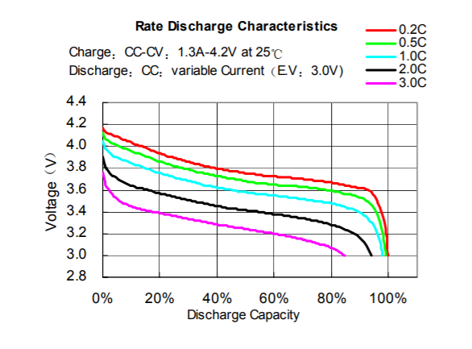
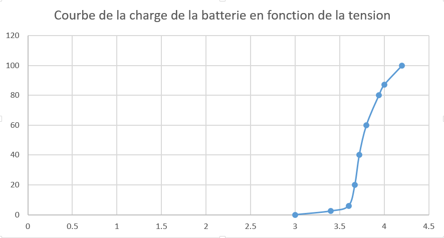
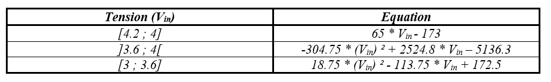

# Mesure de la batterie

Il convient de savoir que la courbe de la décharge d'une batterie n'est pas linéaire mais a plutôt cette forme (trouvable sur la [datasheet](datasheet.pdf) )

Il est possible d'obtenir la tension d'entrée grâce au micronctôleur en multipliant le résultat de la fonction _read()_ par la tension d'alimentation du microcontrôleur (ici _3.3 V_) et en divisant par 0.6 dû au pont diviseur de tension. Il ne nous reste plus qu'à trouver l'équation de la courbe en fonction de la tension d'entrée afin de pouvoir obtenir la mesure du pourcentage de la batterie.

Pour cela, nous traçons tout d'abord sur Excel la courbe de décharge de la batterie en inversant les axes, le fichier étant disponible [ici](courbe_charge.xlsx). Nous aurons donc le pourcentage de la batterie en fonction de la tension d'entrée comme sur l'image ci dessous.

Il ne nous reste plus qu'à faire un clique droit sur la courbe et ajouter une courbe de tendance. Excel propose de nombreuses possibilités de modélisations de courbes de tendances (linéaires, polynomiales, logarithmiques ...). Il convient de les tester une à une jusqu'à obtenir celle se confondant le plus possible avec la courbe voulue, puis d'afficher son équation.

La courbe que nous avons étant particulière, nous la divisons en trois tronçons : un tronçon linéaire entre 4 V et 4.2 puis deux tronçons polynomiaux entre 3.6 V et 4 V puis 3 V et 3.6 V. Excel nous fournit donc les équations suivantes qui seront implémentées dans le code.

